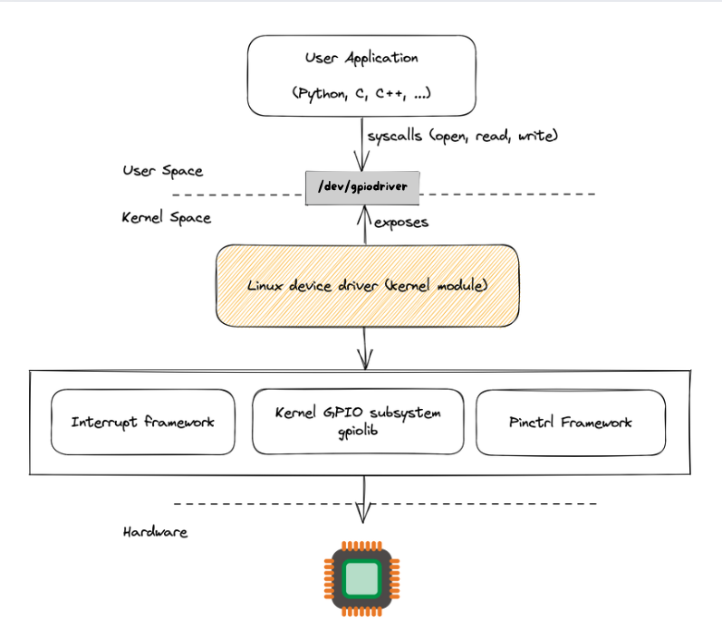

# TP5 - RaspberryPi-Driver - Sistemas de Computación 2024

## Integrantes:

- Nestor Jeremías Pasolli
- Alex Agustín Hernando
- Tomás Moyano

## Consigna

Un "driver" es aquel que conduce, administra, controla, dirige, monitorea la entidad bajo su mando. Un "bus driver" hace eso con un "bus". De manera similar, un "device driver" hace eso con un dispositivo. Un dispositivo puede ser cualquier periférico conectado a una computadora, por ejemplo, un mouse, un teclado, una pantalla/monitor, un disco duro, una cámara, un reloj, etc., cualquier cosa.

Un "driver" puede ser una persona o sistemas automáticos, posiblemente monitoreados por otra persona. Del mismo modo, el "device driver" podría ser una pieza de software u otro periférico/dispositivo, posiblemente controlado por un software. Sin embargo, si se trata de otro periférico/dispositivo, se denomina "device controller" en el lenguaje común. Y por "driver" solo nos referimos a un "software driver". Un "device controller" es un dispositivo en sí mismo y, por lo tanto, muchas veces también necesita un "driver", comúnmente conocido como "bus driver".

Los ejemplos generales de "device controller" incluyen controladores de disco duro, controladores de pantalla, controladores de audio para los dispositivos correspondientes. Ejemplos más técnicos serían los controladores para los protocolos de hardware, como un controlador IDE, un controlador PCI, un controlador USB, un controlador SPI, un controlador I2C, etc. 

En el desarrollo de esta clase veremos estas sutiles diferencias y aprenderemos a construir un "driver" de caracteres.

Para superar este TP tendrán que diseñar y construir un CDD que permita sensar dos señales externas con un periodo de UN segundo. Luego una aplicación a nivel de usuario deberá leer UNA de las dos señales y graficarla en función del tiempo. La aplicación tambien debe poder indicarle al CDD cuál de las dos señales leer. Las correcciones de escalas de las mediciones, de ser necesario, se harán a nivel de usuario. Los gráficos de la señal deben indicar el tipo de señal que se
está sensando, unidades en abcisas y tiempo en ordenadas. Cuando se cambie de señal el gráfico se debe "resetear" y acomodar a la nueva medición.

Se recomienda utilizar una Raspberry Pi para desarrollar este TP.

## Desarrollo

El Trabajo práctico se desarrolló utilizando una RaspberryPi 3B.


Escribimos dos programas. El primero es el driver propiamente dicho, que es un módulo de kernel que se debe cargar dinámicamente, y asociar al filesystem del sistema operativo, específicamente al archivo /dev/gpiodriver. Este archivo es el que nos servirá para comunicar el driver (espacio de kernel), con la aplicación de usuario (espacio de usuario), nuestro segundo programa. La siguiente imagen ilustra esta dinámica:



El driver se encarga de sensar una señal digital por algún pin de GPIO. Por defecto el driver comienza a sensar el pin 20 al ser cargado como módulo en el kernel. El funcionamiento del driver permite sensar cualquiera de los pines disponibles de la RaspberryPi 3b, será decisión de la aplicación de usuario cuál pin sensar en cada momento. Para que esta pueda seleccionar el pin deseado, interactuará con el driver mediante llamadas del sistema como read y write en este caso.

Resumiendo, el driver se encarga de sensar el pin seleccionado y escribir el resultado al espacio de usuario, mendiante /dev/gpiodriver. A su vez, la aplicación de usuario hace el camino inverso, escribiendo en /dev/gpiodriver el pin que desea que el driver sense. Además, esta aplicación graficará los valores sensados en tiempo real.

### Driver

El archivo [gpio_driver.c](gpio_driver.c) contiene el código fuente del driver, a continuación se detallan sus funciones principales.

#### Funciones init y exit

Estas son las funciones que se ejecutan al cargar/descargar el módulo del kernel:

```c
static int __init gpio_module_init(void) {

    int result;
    dev_t dev = MKDEV(drv_major,0);

    printk("Initializing GPIO driver\n");
    result = alloc_chrdev_region(&dev, 0, 1, DEV_NAME);
    drv_major = MAJOR(dev);

    if (result < 0) {
        pr_alert("[GPIO]: Error in alloc_chrdev_region\n");
        return result;
    }

    gpio_cdev = cdev_alloc();
    gpio_cdev->ops = &gpio_fops;
    result = cdev_add(gpio_cdev, dev, 1);
    if (result < 0) {
        printk("[GPIO]: Error in cdev_add\n");
        unregister_chrdev_region(dev, 1);
        return result;
    }

    gpio_registers = (int *)ioremap(BCM2837_GPIO_ADDRESS, PAGE_SIZE);
    if (gpio_registers == NULL) {
        printk("Failed to map GPIO memory in Raspi to driver\n");
        return -1;
    }

    gpio_pin_setup(gpio_selected);
    timer_setup(&timer_1hz, read_gpio, 0);
    mod_timer(&timer_1hz, jiffies + msecs_to_jiffies(INTERVAL_MS));

    printk("Successfully loaded GPIO driver\n");
    return 0;
}

static void __exit gpio_module_exit(void)
{
    printk("Removing GPIO driver\n");
    dev_t dev = MKDEV(drv_major,0);
    cdev_del(gpio_cdev);
    unregister_chrdev_region(dev, 1);
    del_timer(&timer_1hz); //Se elimina el timer.
}
```

La función init se encarga de "registrar" el módulo como un CDD, asociándole un "Major" y un "Minor" para identificarlo. La función asigna dinámicamente un "Major" que esté disponible en el SO, y como "Minor" se asigna el número 0, ya que este driver no controlará otros dispositivos. También, la función asocia funciones propias del módulo a ejecutarse cuando se aplique un "read" o un "write" al archivo que representa al driver (en este caso /dev/gpiodriver). Finalmente, asocia la dirección física de la Raspberry en la cual comienzan los registros para manejar GPIO a una dirección lógica en nuestro programa (que podemos manejar con un puntero), configura el pin a leer por defecto (pin 20) y arranca un timer para comandar la lectura cada 1 segundo.

La función exit, por otro lado, se encarga de "dar de baja" al driver, quitando su registro en el kernel como CDD, y desasociando su "Major" y "Minor", borrando también el timer empleado por el módulo.

#### Funciones de control de GPIO

Estas son las funciones que manejan los pines de GPIO:

```c
static void gpio_pin_setup(unsigned int pin) {
    unsigned int fsel_index = pin / 10;
    unsigned int fsel_bitpos = pin % 10;
    unsigned int *gpio_fsel = gpio_registers + fsel_index;

    *gpio_fsel &= ~(7 << (fsel_bitpos * 3));
    gpio_selected = pin;

    return;
}

static void read_gpio(struct timer_list *timer) {
    printk("Reading GPIO %d\n", gpio_selected);
    unsigned int lev_index = gpio_selected / 32;
    unsigned int lev_bitpos = gpio_selected % 32;
    volatile unsigned int* gpio_lev = (volatile unsigned int*)((char*)gpio_registers + 0x34 + (lev_index * 4));

    gpio_value = *gpio_lev & (1 << lev_bitpos) ? 1 : 0;
    mod_timer(timer, jiffies + msecs_to_jiffies(INTERVAL_MS));
}
```

La funcion de setup se encarga de configurar el pin seleccionado (será seleccionado desde la aplicación de usuario), para indicarle al driver que ese pin es el que debe ser leído a continuación.

La función de read es la que efectivamente hace la lectura del pin, guardando en una variable el valor leído, y reiniciando el timer para la próxima lectura.

#### Funciones read y write

Estas son las funciones que actúan para comunicar el driver (espacio de usuario) con la aplicación de usuario (espacio de usuario), y son ejecutadas cuando la aplicación de usuario lee o escribe sobre el archivo /dev/gpiodriver:

```c
ssize_t read(struct file *file, char __user *buf, size_t count, loff_t *f_pos)
{
    if(*f_pos > 0) {
        return 0; //EOF
    }

    if(copy_to_user(buf, &gpio_value, sizeof(gpio_value)))
    {
        return -EFAULT;
    
    }
    return sizeof(gpio_value);
}

ssize_t write(struct file *file, const char __user *user, size_t size, loff_t *off)
{
    unsigned int pin = 22;

    memset(data_buffer, 0x0, sizeof(data_buffer));

    if (size > MAX_USER_SIZE) {
        size = MAX_USER_SIZE;
    }

    if (copy_from_user(data_buffer, user, size))
        return 0;

    if (sscanf(data_buffer, "%d", &pin) != 1) {
        printk("Inproper data format submitted\n");
        return size;
    }

    if (pin > 21 || pin < 0) {
        printk("Invalid pin number submitted\n");
        return size;
    }

    printk("Pin %d selected\n", pin);
    gpio_pin_setup(pin);


    return size;
}
```

La función read se encarga de copiar al espacio de usuario el último valor leído por el pin de GPIO sensado, mientras que la función write se encarga de cambiar el pin que se va a sensar. De esta manera, cuando la aplicación de usuario quiera graficar la señal, leerá el archivo /dev/gpiodriver para que el driver le pase el valor sensado, mientras que cuando la app quiera cambiar el pin a sensar escribirá en este archivo, desencadenando el cambio por parte del driver. 

### Aplicación de usuario

Esta aplicación es un script de Python, que se encarga de graficar en tiempo real la señal sensada, y permite también al usuario cambiar el pin que desea sensar, permitiendo seleccionar cualquier pin de la Raspberry (0-21). A continuación se presenta una imagen de la interfaz de usuario:


## Requerimentos e instalación

### Instalación de driver

En primer lugar, para poder compilar el módulo de kernel en la RaspberryPi 3B, debemos instalar los headers del kernel correspondientes, ya que nuestro archivo Makefile hace uso de estos para compilar el módulo correctamente:

```bash
$ sudo apt install raspberrypi-kernel-headers
```

Una vez hecho esto, podemos clonar el repositorio, compilar e instalar el módulo con los siguientes comandos:

```bash
$ git clone https://github.com/JerePasolli/TP5-RaspberryPi-Driver.git
$ cd TP5-RaspberryPi-Driver
$ make
$ chmod +x load_driver.sh && sudo ./load_driver.sh
```

Una vez cargado el módulo con estos comandos, el driver ya estará en funcionamiento, sensando por defecto el pin 20 de GPIO.

### Aclaración sobre load_driver.sh

Este archivo se encarga de cargar el módulo, mendiante el comando insmod. Sin embargo, no es la única tarea que realiza. Además de esto, este script obtiene el "Major" asociado a nuestro CDD, y luego ejecuta el comando mknod, asociando el driver con el archivo /dev/gpiodriver. Esto es necesario ya que al cargar el módulo este se agrega como CDD en el kernel, pero no se asocia a un nodo en el filesystem. De esto último es de lo que se encarga mknod.

### Aplicación de usuario

Para el correcto funcionamiento de la app de usuario debemos instalar la librería matplotlib, de la siguiente manera:

```bash
$ pip install matplotlib
```

Y luego simplemente ejecutar el script de python:

```bash
$ python3 monitor.py
```

## Circuito propuesto y pruebas

Pusimos a prueba la aplicación y el driver conectando diferentes componentes a varios pines de GPIO de la Raspberry.
